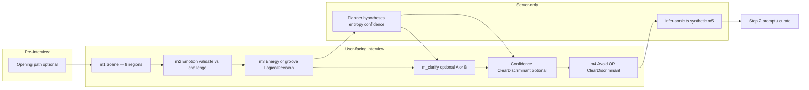

# Interview strategy — genre coverage analysis

**Subject:** [INTERVIEW-STRATEGY-v3.md](./INTERVIEW-STRATEGY-v3.md) (recommended target); [INTERVIEW-STRATEGY-v2.md](./INTERVIEW-STRATEGY-v2.md); [INTERVIEW-STRATEGY.md](./INTERVIEW-STRATEGY.md) (v1 baseline)  
**Date:** 2026-06-25 (v1 analysis); **updated** 2026-06-25 (v2 delta)  
**Method:** Document trace + cross-reference to skill canon (`step-1-interview.md`, `GENRE_COVERAGE.md`), implementation constants (`Q1_COVERAGE_REGIONS`), and maintainer tier model  
**Question:** Can this strategy reach the **majority of genres**? What does it miss?

**Implementation note:** When building, follow **v3** ([INTERVIEW-STRATEGY-v3.md](./INTERVIEW-STRATEGY-v3.md)). v2/v1 are historical snapshots.

---

## Design priority (v2 — coverage over precision)

**Product choice (2026-06-25):** Unresolved genre ambiguity after the interview is **generally fine**. What matters more is **not missing** a genre neighborhood the user's answers still allow.

| Layer | Priority |
|-------|----------|
| **Interview (Q1)** | **Breadth** — nine regions must be reachable; verify enforces partition |
| **Interview (later turns)** | **Minimize** discriminant questions; ask only on `coverageRisk` (skipping would exclude a valid cluster from curate) |
| **Curate (~26 tracks)** | **Represent all** clusters in `hypotheses[]` — at least 2–4 lines per cluster; no silent collapse to one subgenre |
| **Precision** | Secondary — user may pick **You decide**; agent resolves at curate, not by forcing interview picks |

This shifts emphasis from the original v2 draft (entropy-triggered ClearDiscriminant) toward **playlist breadth** as the ambiguity sink. See [INTERVIEW-STRATEGY-v2.md § Coverage over precision](./INTERVIEW-STRATEGY-v2.md#coverage-over-precision-design-priority) and § Playlist breadth at curate.

**Implication for this report:** Tier B "collisions" (folk vs trip-hop vs jazz) are less interview failures if curate spans all three. Benchmarks should audit **curate output**, not only interview discrimination. Niche Tier C/D genres still need opening path or remain out of scope.

---

## Executive summary

### v2 verdict (recommended target)

| Question | Verdict | Confidence |
|----------|---------|------------|
| Majority of **everyday “I don’t know what I want” vibe playlists**? | **Yes** | High |
| Majority of **Spotify genre labels**, precisely? | **No** (~45–55% direct) | Medium |
| Majority of **all genres in a taxonomy sense**? | **No** | High |
| Majority of **niche / rhythm-native / culture-defined genres** without user naming them? | **No** (~30–40%) | Medium |

**Bottom line (v2):** Still **deliberately not a genre picker** — scene × feeling × body energy, plus optional rhythm and confidence discriminants, then inferred M5. Serves mood-first discovery well and covers a **majority of common listening intents**. Cannot reliably reach a majority of named genres unless the user states genre in the **opening path** or free text.

**v2 vs v1:** v2 is **materially better**. It directly addresses the top gaps from the original analysis (timbre regression, rhythm-native partition, aggression filtering, opening passthrough) while preserving product principles. Tradeoff: **higher implementation complexity** (9 Q1 regions, 3 question modes, 4–6 turns, entropy/confidence planner).

### v1 verdict (baseline — superseded)

| Question | v1 verdict |
|----------|------------|
| Everyday vibe playlists | Yes |
| Spotify genre labels, precise | No (~40–50%) |
| Niche without user naming genre | No (~25–35%) |
| Timbre routing risk | **High** — inferred M5 only; ClearDiscriminant tied to M4 gate |

---

## v1 → v2 delta (coverage impact)

| Area | v1 | v2 | Coverage impact |
|------|----|----|-----------------|
| Q1 regions | 6 | **9** (+ `rhythm-social`, `edge-charged`, `elsewhere-transit`) | **+** rhythm-native, edge/aggressive, travel/world mood |
| Last question | M4 gate drives ClearDiscriminant | **Confidence gate decoupled** from M4 gate | **+** timbre splits when inference uncertain |
| M3 rhythm | Body tempo images only | **`needsGrooveGrain`** → LogicalDecision (body move + gloss) | **+** offbeat vs on-grid without genre names |
| `m_clarify` | Scene / feeling / setting | **+ latent scene (A)** + **memory shape (B)** | **+** era/familiarity; indirect timbre routing |
| Opening | Not specified | **Opening path** triage (constraints, reference, genre passthrough) | **+** Tier C/D when user has partial intent |
| M2 | Scene images | **Validate vs challenge** (emotional function) | **+** Tier B collisions from same scene |
| Edge / aggression | Implicit in `restless-charged` | **`edge-charged` region** + M4 filter exceptions | **+** punk/metal-adjacent paths |
| Escape hatch | None | **`you-decide`** on LogicalDecision / confidence turns | **+** UX when agent uncertain |
| Interview length | 4–5 turns | **4–6 turns** | Neutral — optional turns only when needed |
| Maintenance | Basic checklist | Expanded `genreReach`, benchmark suite | **+** enforceability |

### What v2 fixes (mapped to original gap list)

| Original gap | v2 mechanism | Status |
|--------------|--------------|--------|
| §1 No rhythm-native dimension | `rhythm-social` + `needsGrooveGrain` M3 | **Partially fixed** |
| §2 No culture/region axis | `elsewhere-transit` + opening path | **Partially fixed** |
| §3 Aggression gap | `edge-charged` + M4 exceptions | **Partially fixed** |
| §4 Anti-glossy vs hyperpop/K-pop | Unchanged | **Open** |
| §5 Timbre routing off-interview | Confidence-gated ClearDiscriminant + `you-decide` | **Mitigated** (still depends on `infer-sonic.ts`) |
| §6 Incomplete `genreReach` | Nine-region table + Tier B collision notes in v2 doc | **Documented**; implementation pending |
| §7 Retrieval not validated | Unchanged | **Open** |
| §8 `m_clarify` can't close sonic gaps | Confidence discriminant (pace, groove, space, vocal) | **Partially fixed** |

### Recommendations from v1 — v2 status

| # | Original recommendation | v2 status |
|---|-------------------------|-----------|
| 1 | Benchmark `infer-sonic.ts` on Tier B collisions | **In v2 checklist** (§ Benchmark suite) |
| 2 | Extend planner hypotheses table | **In v2** (§ Planner hypothesis checklist) |
| 3 | Opening-message genre passthrough | **In v2** (§ Opening path) |
| 4 | Rhythm latent on ClearDiscriminant | **In v2** (`needsGrooveGrain` M3 + confidence groove axis) |
| 5 | No genre menu; document free-text path | **In v2** (opening path rules) |
| 6 | Re-run niche spot-check after ship | **Still required** |

---

## Scope and evidence base

### Primary sources

| Source | Role |
|--------|------|
| `docs/INTERVIEW-STRATEGY-v2.md` | **Recommended target** — nine regions, confidence gate, opening path |
| `docs/INTERVIEW-STRATEGY.md` | v1 baseline snapshot |
| `apps/api/src/llm/interview/prompts.ts` → `Q1_COVERAGE_REGIONS` | Implementation today: **six regions** (v2 requires extending to nine) |
| `~/.cursor/skills/create-playlist/step-1-interview.md` | Product spec |
| `~/.cursor/skills/create-playlist/GENRE_COVERAGE.md` | Maintainer tier model (A–D), niche spot-check |

### What “genre coverage” means here

1. **Interview** — Can 4–6 scene/feeling questions *express* intent without a genre menu?
2. **Prompt / curate** — Does the brief carry enough sonic detail?
3. **Retrieval** — Platform-dependent; not guaranteed

Genre-as-identity requests (e.g. “black metal only”, “bachata”) remain **out of scope** unless the opening path names them.

---

## Coverage architecture (v2)

### Mechanism map

| Stage | Coverage lever | Genre discrimination strength (v2) |
|-------|----------------|--------------------------------------|
| **Opening path** | Intent, constraints, reference, genre enhancer | **High** when user names genre or reference |
| **M1 (Q1)** | Nine scene regions; 8–10 options | **High (breadth)** — adds rhythm, edge, transit |
| **M2** | Validate vs challenge (emotional function) | **Medium** — splits same-scene hypotheses |
| **M3** | Body tempo **or** groove-grain LogicalDecision | **Medium–high** when `needsGrooveGrain` |
| **m_clarify** | Latent scene (A) or memory shape (B) | **Medium** — era/familiarity + indirect timbre |
| **Confidence ClearDiscriminant** | Pace, groove, space, vocal; includes `you-decide` | **Low–medium** — only when `coverageRisk`; not for entropy alone |
| **M4 avoid** | Multi-select negatives (with edge exceptions) | **Medium** |
| **Inferred M5** | 1–2 timbre cues; tie-break when user picks `you-decide` | **Unknown (planned)** |
| **Curate breadth** | ≥2–4 tracks per cluster in `hypotheses[]` | **High** — primary ambiguity resolver |

### Nine Q1 regions — v2 `genreReach`

**Original six** (unchanged from v1):

| Region ID | Declared genre families |
|-----------|-------------------------|
| `intimate-still` | ambient, folk, neo-classical, intimate singer-songwriter |
| `bittersweet-mid` | indie, alt, mellow pop, sad-not-heavy R&B |
| `focus-flow` | focus electronic, lo-fi, light jazz, instrumental |
| `social-mid` | indie pop, soul/R&B mood, mellow hip-hop, lounge |
| `kinetic-high` | house/techno energy, upbeat pop, gym-pop, rock/alt drive |
| `restless-charged` | alt-rock, charged R&B, post-punk, restless electronic |

**Three new in v2:**

| Region ID | Declared genre families |
|-----------|-------------------------|
| `rhythm-social` | reggae, ska, afrobeat, latin social dance mood, funk |
| `edge-charged` | punk, metal-adjacent drive, post-punk, noise-rock energy |
| `elsewhere-transit` | world lounge, city-pop mood, travel ambient, global pop |

**Verify (v2):** one option per **nine** regions on fresh interview; 8–10 options; ≥1 kinetic/crowd; ≥1 non-domestic; passive distant bass ≠ `kinetic-high`.

---

## Tier analysis (v2-adjusted)

### Tier A — strong (~40–55% of typical vibe requests)

**Reach: Good** — unchanged from v1; v2 M2 validate/challenge slightly improves routing within Tier A.

### Tier B — partial (~25–35% of genre labels)

**Reach: Improved vs v1** — confidence discriminant + m_clarify families + M2 function reduce collision risk.

| Cluster examples | v2 path | v1 risk | v2 risk |
|------------------|---------|---------|---------|
| Rock / alt / post-rock | kinetic, restless, edge-charged | Guitar collision | **Lower** — edge region + confidence turn |
| Shoegaze / dream pop / emo | bittersweet + validate M2 | Inference only | **Lower** — cathartic vs hold splits |
| Reggae / dub / ska | rhythm-social + needsGrooveGrain | **No region** | **~** — offbeat axis without genre name |
| Latin social / funk | rhythm-social | Weak | **~** — not bachata/reggaeton-specific |
| Jazz beyond small club | focus, social-mid + confidence | Weak | **~** — vocal/space discriminant helps |
| K-pop / glossy pop | kinetic vs M4 anti-glossy | Often excluded | **Still weak** unless opening widens |
| City pop / era-tinted synth | elsewhere-transit + memory shape m_clarify | Era weak | **~** — improved |

**v1 regression risk (M5 removed):** **Mitigated in v2** by confidence-gated ClearDiscriminant — not eliminated until `infer-sonic.ts` is benchmarked.

### Tier C — rhythm- or culture-defined (~15%)

**Reach: Poor → partial** vs v1.

| Cluster examples | v2 | Notes |
|------------------|-----|-------|
| Afrobeat / highlife / ska / funk | **~** | rhythm-social + groove grain |
| Reggaeton / dembow | **✗** | No dembow-specific axis |
| Bachata / regional Latin | **✗** | Social latin mood ≠ idiom |
| UK garage / jungle / DnB | **✗** | No 2-step vocabulary |
| Drill / grime / phonk | **✗** | Still filtered unless edge path + opening |

### Tier D — extreme / regional / art-music (~15%)

**Reach: Poor → partial** for edge; still poor for art/regional idiom.

| Cluster examples | v2 | Notes |
|------------------|-----|-------|
| Punk / metal-adjacent / noise-rock | **~** | edge-charged + M4 exceptions |
| Black metal / hardcore (extreme) | **✗** | Neighborhood OK at best; user genre still best |
| Hyperpop / breakcore | **✗** | Anti-glossy M4 tension |
| Flamenco / mariachi / fado / klezmer | **✗** | elsewhere-transit is travel mood, not idiom |
| Opera / period classical | **✗** | Unchanged |

---

## Can it read the majority of genres?

### Definitions (v2 estimates)

| Interpretation | v1 | v2 |
|----------------|----|----|
| Majority of mood/activity playlist sessions | Yes | **Yes** |
| Majority of Spotify genre tags (precise subgenre) | No (~40–50%) | **No (~45–55%)** |
| Majority of broad clusters (rock, electronic, jazz) | ~65–75% | **~75–80%** |
| Majority of niche tags without user naming genre | No (~25–35%) | **No (~30–40%)** |

Precise subgenre share rises modestly because v2 adds breadth and discriminants, not a taxonomy.

### Niche spot-check projection (30 genres, no user naming genre)

Maintainer baseline (`GENRE_COVERAGE.md`): 8 ✓ / 10 ~ / 12 ✗.

| Outcome | v1 (est.) | v2 (est.) | Likely v2 flips |
|---------|-----------|-----------|-----------------|
| ✓ OK | ~8 (27%) | **~10–11 (33–37%)** | dark ambient (unchanged); possible ska partial→✓ |
| ~ Partial | ~10 (33%) | **~12–14 (40–47%)** | afrobeat, dub, noise rock, shoegaze, emo, city pop, trip-hop, bossa, gospel, krautrock |
| ✗ Fail | ~12 (40%) | **~8–9 (27–30%)** | bachata, UK garage, drill, phonk, flamenco, opera, hyperpop, chiptune, mariachi, fado, reggaeton |

**Still ✗ without opener (v2):** bachata, UK garage, drill, phonk, flamenco, opera, hyperpop, chiptune, mariachi, fado, reggaeton, black metal (identity-level).

### Well covered (v2)

All v1 families **plus:** reggae/ska/afrobeat/funk (mood-level), punk/metal-adjacent drive (mood-level), world lounge / travel ambient / city-pop mood.

### Partially covered (v2 — improved band)

Reggae, ska, afrobeat, funk, dub, noise-rock energy, shoegaze/emo (M2), city pop (memory shape), trip-hop (confidence groove), bossa (social-mid + confidence).

### Still poorly covered (v2)

Reggaeton, dembow, UK garage, jungle, DnB, drill, grime, phonk, hyperpop, regional traditional idioms, opera, art music, chiptune, identity-level metal.

---

## Systematic gaps (remaining after v2)

### Addressed or mitigated in v2

1. **Rhythm-native dimension** — `rhythm-social` + `needsGrooveGrain` (partial).
2. **Culture / region** — `elsewhere-transit` + opening path (partial).
3. **Aggression gap** — `edge-charged` + M4 exceptions (partial).
4. **Timbre routing** — confidence ClearDiscriminant + `you-decide` (mitigated; `infer-sonic.ts` still critical).
5. **`genreReach` documentation** — nine regions in v2 doc (implementation pending in `prompts.ts`).
6. **Sonic splits via clarify only** — confidence turn adds pace/groove/space/vocal axes.

### Still open

1. **Anti-glossy M4 vs hyperpop / glossy K-pop** — no v2 change.
2. **Rhythm identity precision** — dembow, 2-step, dembow/reggaeton vs afrobeat/funk collisions in `rhythm-social`.
3. **Regional traditional idioms** — flamenco, mariachi, klezmer, fado need user naming or reference track.
4. **Retrieval layer** — not validated.
5. **Implementation risk** — nine-region Q1 with 8–10 options is harder for LLM; verify must enforce or coverage exists only on paper.
6. **`you-decide` quality** — when chosen, output depends entirely on inference + hypotheses.

---

## Target vs current — three-way delta

| Aspect | Production (today) | v1 doc | **v2 doc (implement)** |
|--------|-------------------|--------|-------------------------|
| Steps | 5 fixed (incl. user m5) | 4–5 | **4–6** |
| Q1 regions | 6 | 6 | **9** |
| Sonic palette | User M5 | Inferred M5 | Inferred M5 + **confidence escape** |
| Rhythm | Opaque M5 | Body images | **Groove LogicalDecision + gloss** |
| Last question | M4 or unclear M5 | M4 gate OR Clear | **Confidence gate** then M4 gate |
| Opening | Ad hoc message | None | **Opening path triage** |
| m_clarify | None | Scene/feeling | **+ latent scene + memory shape** |
| Tier B timbre risk | Low (explicit M5) | **High** | **Medium** (confidence turn) |
| Niche without naming (~30 samples) | ~27% ✓ | ~27% ✓ | **~33–37% ✓ (est.)** |

---

## Failure modes (v2-specific)

| Mode | Mechanism | Example |
|------|-----------|---------|
| **Inference collapse** | `infer-sonic.ts` generic output | Trip-hop → acoustic folk |
| **Nine-region Q1 drop** | LLM skips rhythm-social or edge-charged | Verify fails or silent bias |
| **`you-decide` overuse** | User picks escape on every LogicalDecision | Brief under-specified |
| **Groove grain misfire** | `needsGrooveGrain` false when rhythm collision likely | Reggae path never opens |
| **Edge over-correction** | edge-charged + aggressive M4 after user wanted cathartic alt only | Wrong heaviness |
| **Opening path unused** | UI phase 2 not shipped | Tier C/D users don't get passthrough |
| **Mode hybrid creep** | SceneFeeling vs LogicalDecision routing bugs | Cryptic or inconsistent turns |

Inherited from v1: scenery without timbre, planner hypothesis drift, verify forcing safe/generic options.

---

## Recommendations (post-v2)

Priority for implementation — v2 doc already includes items 1–5 from the original list.

1. **Ship v2, not v1** — use [INTERVIEW-STRATEGY-v2.md](./INTERVIEW-STRATEGY-v2.md) as implementation spec.
2. **Extend `Q1_COVERAGE_REGIONS` to nine** in `prompts.ts` before relying on coverage claims.
3. **Run v2 benchmark suite** before production cutover (Tier B fixtures + niche spot-check + batch Q1).
4. **Opening path API types day one** — UI can follow; genre passthrough should work from first message even without triage UI.
5. **Monitor `you-decide` rate** — high rate is OK if curate spans all `hypotheses[]`; flag **curate collapse** (26× one subgenre).
6. **Curate breadth audit** — Tier B fixtures must assert multi-cluster representation in propose list.
7. **Update this report after benchmark** — replace estimated v2 spot-check with measured results.

---

## Conclusion

**INTERVIEW-STRATEGY-v2.md** is **materially better** than v1 for genre coverage within the product’s mood-first constraints. It does **not** make the interview a genre picker, and it **still does not** cover a majority of Spotify genre tags or niche culture-defined styles without user input — **by design**.

**v2 improvements that matter most:**

- **Confidence-gated ClearDiscriminant** — safety valve on `coverageRisk` only (not entropy-driven interview bloat).
- **Three new Q1 regions** — rhythm-social, edge-charged, elsewhere-transit.
- **`needsGrooveGrain` M3** — systematic offbeat vs on-grid axis without genre names.
- **Opening path** — explicit genre/reference/constraint passthrough.
- **`you-decide`** — honest escape; curate must still cover all plausible clusters.
- **Playlist breadth at curate** — all genres in `hypotheses[]` get tracks in the final list.

**Still required for “play me X genre precisely”:** name X in the opening path or edit the prompt after delivery.

For the stated user (“doesn’t know what they want”), **v2 is fit for purpose and is the recommended implementation target**. v1 remains a useful minimal-diff snapshot but leaves known coverage holes unaddressed.

---

## Related files

- [INTERVIEW-STRATEGY-v3.md](./INTERVIEW-STRATEGY-v3.md) — **recommended target design**
- [INTERVIEW-STRATEGY-v2.md](./INTERVIEW-STRATEGY-v2.md) — coverage, regions, curate
- [INTERVIEW-STRATEGY.md](./INTERVIEW-STRATEGY.md) — v1 baseline (historical)
- [AGENTS.md](../AGENTS.md) — project agent guide
- `~/.cursor/skills/create-playlist/GENRE_COVERAGE.md` — maintainer tier model
- `apps/api/src/llm/interview/prompts.ts` — `Q1_COVERAGE_REGIONS` (six today; extend to nine for v2)
