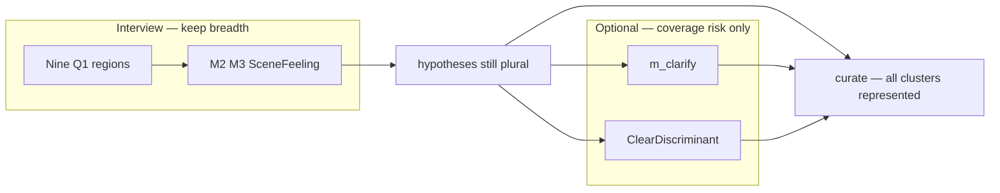
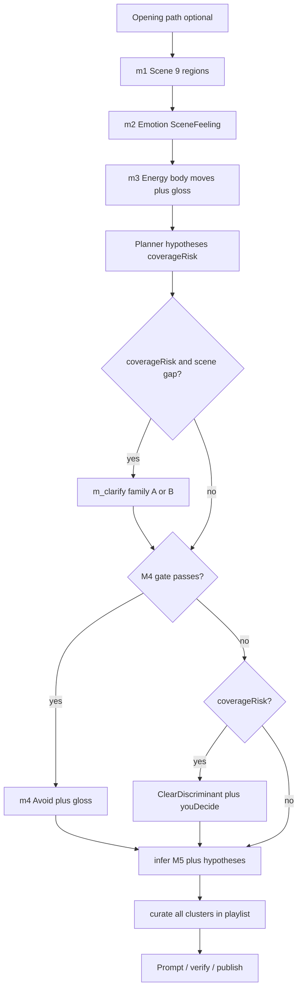

# Interview strategy v2 (target design)

**Status:** Documented — not yet implemented  
**Supersedes:** nothing — [INTERVIEW-STRATEGY.md](./INTERVIEW-STRATEGY.md) (v1) remains the baseline snapshot  
**Informed by:** [INTERVIEW-STRATEGY-COVERAGE-REPORT.md](./INTERVIEW-STRATEGY-COVERAGE-REPORT.md)  
**When implementing:** follow **this document** (v2); treat v1 as historical

**Canonical product spec:** `~/.cursor/skills/create-playlist/step-1-interview.md`  
**Current implementation:** `apps/api/src/llm/interview/` + `apps/api/src/types/interview-step.ts` (production still uses fixed `m1 → m2 → m3 → m5 → m4`)

---

## One-sentence goal

Help users who *don't know what they want* by asking **easy feeling questions** (where am I, how do I feel, how does my body move); let the **agent** own texture and genre splits — **prefer keeping multiple plausible genres alive** over forcing a single precise answer in the interview. **Coverage beats ambiguity resolution:** Q1 must reach every major scene/genre neighborhood; the **curated playlist** must include representatives of all clusters still plausible after the interview, not collapse to one genre because the planner was unsure.

---

## Coverage over precision (design priority)

This priority follows [INTERVIEW-STRATEGY-COVERAGE-REPORT.md](./INTERVIEW-STRATEGY-COVERAGE-REPORT.md) and product intent:

| Priority | Rule |
|----------|------|
| **1. Breadth** | Interview + curate must **not miss** a major genre neighborhood the user's answers still allow. Nine Q1 regions and verify enforcement are the main **coverage** gate. |
| **2. Honest ambiguity** | **Unresolved genre is fine.** If folk, trip-hop, and cool jazz are all still plausible after M1–M3, that is acceptable — do not add interview turns whose main job is to pick one winner. |
| **3. Playlist carries ambiguity** | Step 2 curate must **include tracks from all plausible clusters** in the final ~26-line list (proportional or explicit slots), not average them into one generic "warm sparse human" lane. |
| **4. Discriminant questions last** | Confidence ClearDiscriminant and `m_clarify` only when **skipping them would exclude** a still-valid cluster (coverage failure), not merely because entropy is high. |
| **5. You decide** | On LogicalDecision turns, **`you-decide` is the preferred outcome** when breadth matters — agent resolves at curate using `hypotheses[]`, not by pressuring the user. |

**Not the goal:** Precise Spotify subgenre ID from interview alone. **Is the goal:** User never feels "this playlist could not have been [genre X]" when X was still consistent with their scene/feeling answers.



---

## What changed from v1

| Area | v1 | v2 |
|------|----|----|
| Q1 regions | 6 | **9** (+ `rhythm-social`, `edge-charged`, `elsewhere-transit`) |
| Last question | M4 gate drives ClearDiscriminant | **Confidence gate** + M4 gate (**decoupled**) |
| M3 rhythm | Body tempo images | **Body move** main line + **gloss** in parentheses; LogicalDecision turns include **You decide** |
| `m_clarify` axes | Scene / feeling / setting only | + **latent scene** (family A) and **memory shape** (family B); planner picks |
| Opening | Not specified | **Opening path** (pre-interview triage) |
| M2 | Emotion via scene images | **Validate vs challenge** — emotional *function*, documented |
| Edge / aggression | Mostly implicit in `restless-charged` | **`edge-charged`** Q1 region + M4 filter exceptions |
| Maintenance | Basic checklist | Expanded `genreReach`, planner hypothesis checklist, benchmark suite |
| Interview length | 4–5 turns | **4–6 turns** (optional turns only on **coverageRisk**) |
| Design priority | Ambiguity resolution | **Coverage over precision** + curate breadth |

---

## Product principles

### What we ask the user

| Ask | Don't ask |
|-----|-----------|
| Where am I? What's around me? | What genre? What instrument? |
| Should the music hold me or nudge me? (M2) | Name your mood (therapy adjectives) |
| How does my body want to move? (M3) | What should the music texture be? |
| One clear discriminant when **skipping it would drop a valid cluster** | Cryptic sonic metaphors with no decoder |
| **You decide** when ambiguity is acceptable | Forcing the user to pick one genre lane |
| What must we **not** sound like? (plain + gloss) | Genre menus or instrument pick lists |

### Three question modes — never hybrid

**1. SceneFeeling** (default)

- Poetic, vivid language when options are **concrete film-stills** the user can inhabit.
- User test: *"Can I answer by picturing where I am and how I feel — without guessing this is about music production?"*
- Used for: M1 Scene, M2 Emotion, most M3 Energy, optional `m_clarify`.
- Gloss: optional; add when a line is cryptic.

**2. ClearDiscriminant** (when planner needs a split)

- One plain axis; pattern: `[plain motion / groove / avoid type], [optional image]`.
- **Mandatory gloss** on every option except `you-decide`.
- Used for: confidence-gated last turns, M4 Avoid (when gate passes), M3 groove-grain LogicalDecision.

**3. LogicalDecision** (subtype of ClearDiscriminant)

- User must pick a **discriminant** (pace grain, vocal presence, groove type) — not express a feeling.
- **Every** LogicalDecision turn **must** include option id `you-decide`:
  - EN: *"You decide"*
  - ZH: *"你来定"*
  - No gloss on this option — agent chooses from remaining hypotheses and **must still cover all clusters at curate** unless one was ruled out by prior answers.
- Other options: **body move or plain phrase** as main line; **gloss required** in parentheses with clearer language.

#### Option shape examples (LogicalDecision / rhythm M3)

| Main (EN) | Gloss (EN) |
|-----------|------------|
| Hips find the gap | offbeat sway, not marching |
| Feet in a line | steady on-grid pulse |
| Shoulders loose, barely moving | slow drift, almost still |
| You decide | *(no gloss — agent chooses)* |

| Main (ZH) | Gloss (ZH) |
|-----------|------------|
| 胯找空隙 | 偏拍摇摆，不齐步 |
| 脚踩成一条线 | 稳拍，落在格子上 |
| 你来定 | *(无注释 — 由系统决定)* |

- `labelEn` / `labelZh` = poetic or plain main only (no parens in those fields).
- `glossEn` / `glossZh` = separate JSON fields when used.
- Chinese gloss composed natively — not calqued from English.

### Hard bans (regression anti-patterns)

Inherited from v1; still fail verify:

| Bad example | Why it fails |
|-------------|--------------|
| Stem: *"Late on the platform, the vending hum stains the air — where does it land?"* | Personifies sound; user must guess sonic axis |
| Options: *"Near enough to breathe"* · *"Thin, out past the tiles"* | Abstract sonic metaphor without scene anchor or gloss |
| Dimension label **质感 / Sound** on a user-facing step | Primes "music texture decision" |
| Stems: *"where does it land?"* · *"声流先落向哪一处？"* | Sound as subject |
| LogicalDecision without `you-decide` | User forced to guess when agent should own uncertainty |
| Options that contradict M1–M3 frame | Not meaningful or consistent |

### Good reference (keep doing this)

**Q1 Scene — concrete setting:**

- Stem: *"Blue light on the stair landing — what waits by the door?"*
- Options: keys on the sill · porch boards, rain still cooling · train doors, bodies shifting

---

## Target flow

```text
[optional] Opening path (pre-interview triage)
  → m1 Scene (SceneFeeling, 9 regions, 8–10 options)
  → m2 Emotion (SceneFeeling, validate vs challenge)
  → m3 Energy (SceneFeeling or LogicalDecision rhythm when needsGrooveGrain)
  → [optional] m_clarify (only on coverageRisk — planner picks axis family A or B)
  → m4 Avoid OR [optional] ClearDiscriminant (only on coverageRisk; includes you-decide)
  → [server] infer M5 sonic floor + hypotheses[] → curate spans all clusters
```



### Step definitions

| ID | Label (EN / ZH) | Mode | Required | Role |
|----|-----------------|------|----------|------|
| `m1` | Scene / 场景 | SceneFeeling | yes | Partition hypothesis space; 8–10 options across **nine** scene regions |
| `m2` | Emotion / 情绪 | SceneFeeling | yes | Validate vs challenge — emotional function through scene |
| `m3` | Energy / 能量 | SceneFeeling or LogicalDecision | yes | Body tempo; groove-grain sub-turn when planner flags `needsGrooveGrain` |
| `m_clarify` | Moment / 一刻 | SceneFeeling | **optional** | One scene beat on planner-chosen axis (family A or B) |
| `m4` | Avoid / 避开 | ClearDiscriminant | yes | Multi-select negatives **or** plain last discriminator |

**No user-facing `m5`.** M5 (sonic palette) is **inferred** server-side before prompt/curate.

---

## Opening path (before Question 1)

### What it is

A short branch on the **landing page or interview start** — **not** an interview question — that captures what the user already knows so the wizard does not ask redundant things.

Think of it as **triage**: the opening path is the triage nurse; the interview asks only what triage did not already establish.

### Why it matters

Many users arrive with partial intent: *"surprise me"*, *"I know a vibe but not words"*, *"something like [song]"*, or hard constraints (*"no vocals"*). The [coverage report](./INTERVIEW-STRATEGY-COVERAGE-REPORT.md) notes that genre or constraints stated in the opener bypass ambiguity that the interview cannot reach with scene questions alone.

### Proposed branches (document only — UI not built)

| User intent | Stored field | Interview effect |
|-------------|--------------|------------------|
| Surprise me | `intent: open` | Full interview; all nine Q1 regions unless filtered |
| I know a vibe, not words | `intent: vibe` | Full interview; `m_clarify` only if `coverageRisk` after M3 |
| Something like… | `reference: string` | Skip or shorten turns the reference resolves; inject enhancer into Step 2 prompt |
| Hard constraints | `constraints: string[]` e.g. `no-vocals`, `acoustic-only` | Pre-fill partial M4; filter incompatible Q1 options |

### Rules

- **Not a genre menu** — free text and soft constraint chips only.
- If the user **names a genre** in the opener → passthrough to prompt/curate as a skill **enhancer**; do not show a genre chip grid.
- Opening data is passed to the planner on every turn (`openingContext` in plan JSON).
- Implementation can be **phase 2 UI**; API types should accept optional opening fields from day one.

---

## M2 Emotion design

### What M2 is for

M2 is **not** "name your mood" with therapy adjectives (*warm connection*, *gentle longing*). It asks what the music should **do emotionally**:

- **Meet you where you are** (validate), or
- **Move you somewhere** (challenge, lift, sting, wash out).

This is **emotional function**, not genre.

### Validate vs challenge

| User need | SceneFeeling option flavor (invent fresh each run) |
|-----------|-----------------------------------------------------|
| Stay in the feeling | *"Hold me right here"* / *"就停在这一刻"* |
| Gentle forward | *"Soft push, not a shove"* / *"轻轻推一把"* |
| Cathartic edge | *"Let it sting a little"* / *"疼一点也好"* |
| Wash out | *"Blur the edges"* / *"把边边角角都晕开"* |

**Example stem:** *"The light's still on — should the music hold you or nudge you?"*  
**ZH shape:** 灯还亮着——音乐是陪你停着，还是推你一把？

### Why it helps coverage

The same scene (bittersweet kitchen at midnight) can route to:

- sad indie (validate, stay),
- warm jazz (gentle forward),
- cathartic alt (sting a little),

without ever asking *"what genre?"*.

### Relation to M3

| Dimension | Territory |
|-----------|-----------|
| **M2** | Emotional color / function — validate vs challenge |
| **M3** | Body tempo / groove — how time moves in the body |

Do not duplicate pace on M2. If an M2 option implies motion (*"restless"*), it must still differ from M3 groove options on the motion axis.

---

## M3 Energy and rhythm-as-body

### Default: SceneFeeling body tempo

Options are motion images in the scene: *"Slow steps beside the desk"* · *"Feet still, pulse in the chest"*.

Gloss optional unless the bodily image is cryptic.

### When `needsGrooveGrain` is true

Planner flags this when rhythm-native collisions are likely (coverage report §1 — reggae, funk, afrobeat, dembow families) **or** when top hypotheses differ on rhythmic grain.

Same M3 slot becomes **LogicalDecision**:

- Stem: scene-anchored — *"On this floor — how is your body moving?"*
- Options: **body move** main + **mandatory gloss** + **`you-decide`**
- Private mapping (never shown to user):

| Body image (example) | Internal groove grain |
|----------------------|------------------------|
| Feet in a line | on-grid, marching pulse |
| Hips find the gap | offbeat, sway |
| Shoulders loose, nodding | minimal motion, drift |
| You decide | agent picks from hypotheses |

Never name reggae, dembow, or genre in options.

---

## Nine Q1 regions

Extend `Q1_COVERAGE_REGIONS` in `apps/api/src/llm/interview/prompts.ts` when implementing.

### Original six (unchanged from v1)

| ID | Territory (summary) | Genre families kept reachable |
|----|---------------------|-------------------------------|
| `intimate-still` | Solo, enclosed, low social heat | ambient, folk, neo-classical, intimate singer-songwriter |
| `bittersweet-mid` | Winding down, mixed feeling | indie, alt, mellow pop, sad-not-heavy R&B |
| `focus-flow` | Task or transit attention | focus electronic, lo-fi, light jazz, instrumental |
| `social-mid` | People nearby, not peak chaos | indie pop, soul/R&B, mellow hip-hop, lounge |
| `kinetic-high` | Body IN loud/kinetic scene | house/techno energy, upbeat pop, gym-pop, rock/alt drive |
| `restless-charged` | Solo but wired | alt-rock, charged R&B, post-punk, restless electronic |

### Three new regions (v2)

| ID | Territory (invent fresh scenes each run) | Genre families kept reachable |
|----|------------------------------------------|-------------------------------|
| `rhythm-social` | Block party spilling onto the sidewalk · kitchen, everyone moving · parade drum from two streets away | reggae, ska, afrobeat, latin social dance mood, funk |
| `edge-charged` | Basement door, bass in the chest · parking lot after the show · hallway before something breaks | punk, metal-adjacent drive, post-punk, noise-rock energy |
| `elsewhere-transit` | Bus in a city you don't live in · night market alley · airport gate at 5am | world lounge, city-pop mood, travel ambient, global pop |

### Q1 verify rules (v2)

- Fresh interview: **one option per region** for all **nine** regions unless opening ruled some out.
- Still require ≥1 `kinetic-high` or crowd-equivalent and ≥1 non-domestic scene.
- Option count: **8–10** when nine regions are active.
- Passive distant bass ≠ `kinetic-high` — listener must be IN the loud scene.

---

## Optional `m_clarify`

### Gate

Insert when:

- ≥2 genre clusters still plausible **and** gap is scene / feeling / setting (**not** sonic gear), **and**
- **`coverageRisk`** — without this question, curate would likely **omit** a neighborhood still consistent with answers.

Also insert when prior answers lightly contradict or opening left a hole M1–M3 did not fill **and** `coverageRisk` is true.

Skip when M1–M3 already allow **curate breadth** across remaining hypotheses, even if entropy stays high.

### Axis families — planner picks one per turn

**Family A — Latent scene** (routes timbre without asking about sound):

| Axis | Example stem direction |
|------|------------------------|
| Social distance | Alone in the crowd vs alone in the room |
| Surface texture | Worn wool vs cold metal vs warm wood under hand |
| Light quality | Neon flat vs candle amber vs overcast grey |

**Family B — Memory shape** (routes era / familiarity):

| Axis | Example option direction |
|------|--------------------------|
| Familiarity | Like an old tape · like a movie you half remember · brand-new room |

Planner sets `clarificationFamily: "latent_scene" | "memory_shape"` and `clarificationAxis` in plan JSON. Agent invents fresh wording; never copy examples verbatim.

`m_clarify` remains **SceneFeeling** — no `you-decide` unless the planner mistakenly flags LogicalDecision (forbidden; verify should fail).

---

## Confidence-gated ClearDiscriminant

**Secondary tool** — use only when **coverage** is at risk, not to maximize precision.

Mitigates coverage report §5 (timbre routing) but must **not** override the [coverage-over-precision](#coverage-over-precision-design-priority) rule: high entropy alone is **not** a reason to ask.

### After M3 (and optional `m_clarify`)

Planner computes:

| Field | Meaning |
|-------|---------|
| `hypotheses[]` | 2–10 internal genre clusters still plausible — **carried through to curate** |
| `coverageRisk` | true when skipping a discriminant would **exclude** a cluster still consistent with answers |
| `entropy` | high when top clusters are evenly weighted — **informational only**; does not by itself trigger a question |
| `top2TimbreGap` | true when #1 and #2 differ on timbre / groove / vocal presence |
| `inferenceConfidence` | `low` \| `medium` \| `high` for draft `inferredM5` |

### Insert ClearDiscriminant when

- `coverageRisk` is **true** — e.g. one cluster requires vocals-forward soul and another requires instrumental focus, and curate cannot honor both without a split or explicit breadth rule, **or**
- User explicitly needs a hard fork (rare) and M4 avoid cannot express it.

### Skip when (default)

- Multiple hypotheses remain plausible but **curate can represent all of them** in the 26-track list.
- User picked **`you-decide`** — agent resolves at curate, not with another question.
- Entropy is high but clusters share the same **coverage neighborhood** (e.g. shoegaze vs dream pop vs emo — curate includes all three flavors).

### Allowed axes (one per turn)

- pace
- groove grain (often LogicalDecision with body moves + gloss)
- space / distance
- vocal presence (*"Words — background, talking to you, or everyone singing?"*)
- avoid clusters (only when M4 gate passes)

### Not allowed

- Poetic sonic metaphor stems
- Instrument menus
- Genre names
- Questions whose only purpose is to collapse entropy without a coverage failure

Every confidence-gated ClearDiscriminant turn includes **`you-decide`** (preferred when ambiguity is acceptable).

---

## Last question routing (decoupled from M4 gate)

Priority order — **minimize turns**; **maximize coverage**; discriminant only on `coverageRisk`:

1. **M4 avoid** if ≥4 non-obvious avoids remain (meaningful, consistent with prior picks).
2. **Confidence ClearDiscriminant** only if `coverageRisk` is true and M4 cannot resolve it.
3. Else **skip extra discriminant** — carry plural `hypotheses[]` to curate.
4. **Never** show M4 when every avoid is already implied — write avoids into prompt only.

### Quality bar (all late turns)

- Stem frame matches every option (night stem → no morning coffee).
- Each option changes the brief — pairwise overlap test.
- Drop options that contradict prior scene/feeling/energy picks.
- LogicalDecision → include `you-decide` (encourage when breadth is OK).

---

## Edge and aggression

### `edge-charged` Q1 region

Carries aggression energy as **place**, not *"metal playlist"*:

- Basement door, bass in the chest
- Parking lot after the show
- Hallway before something breaks

User picks a film-still; agent infers distortion/drive timbre privately.

### M4 filter exceptions

When user picked `edge-charged` **or** (`restless-charged` + cathartic/challenge M2):

- **Do not** drop aggressive / distortion-related avoid options as "already implied."
- **Do not** pre-filter metal/punk/hardcore paths when edge scene was explicitly chosen.

When user picked `intimate-still` + validate M2:

- Drop gym / club / aggressive avoids as today.
- Write implied negatives into prompt.

Only offer options that are **meaningful and consistent** — no gym/club chips after intimate-still unless opening widened the frame.

---

## Planner behavior (full mode)

After each turn — especially after M3 — private plan phase must answer:

1. **Gap check** — scene / feeling / setting still ambiguous?
2. **Hypotheses** — 2–10 clusters (internal only) — **retain plural** unless an answer rules a cluster out.
3. **Coverage risk** — would skipping another question **exclude** a still-valid cluster from curate?
4. **Clarification gate** — `m_clarify` only on scene/feeling gap **and** coverage risk (not for sonic collapse).
5. **`needsGrooveGrain`** — M3 LogicalDecision when rhythm collision risks **missing** a rhythm-native neighborhood.
6. **Inferred M5** — draft timbre cues; may be **broad** when hypotheses are plural.
7. **Last-question routing** — per priority order above.

### Plan output shape (v2 extends v1)

```json
{
  "gaps": ["social distance still ambiguous"],
  "hypotheses": ["indie folk intimate", "cool jazz lounge", "trip-hop dusk"],
  "coverageRisk": false,
  "entropy": "high",
  "top2TimbreGap": true,
  "inferenceConfidence": "low",
  "inferredM5": "whisper-close, worn tape warmth; leave room for jazz piano and trip-hop pulse in curate",
  "needsClarification": false,
  "needsConfidenceDiscriminant": false,
  "lastQuestionMode": "avoid",
  "openingContext": { "intent": "open" },
  "axis": "...",
  "sceneBeat": "...",
  "filterDrops": [],
  "q1RegionsToCover": ["intimate-still", "...", "elsewhere-transit"],
  "stemGuidance": "...",
  "optionGuidance": "..."
}
```

**Fast mode:** Same JSON shape; lighter self-check in single-shot prompt.

---

## Server-side M5 inference

Module (planned): `apps/api/src/llm/infer-sonic.ts`

**Input:** `m1`, `m2`, `m3`, optional `m_clarify`, `m4`, opening context, planner `hypotheses[]`, `inferredM5` draft.  
**Output:** synthetic `m5` `{ id, label, labelEn }` — 1–2 concrete timbre cues for Step 2 prompt.

When **multiple hypotheses remain**, inferred M5 describes a **shared sonic floor** (scene-consistent timbre) and must **not** pretend the interview collapsed to one cluster. Example: *"intimate room, warm low end, space for close guitar or dusty pulse"* — curate supplies cluster-specific tracks.

**Call sites:**

- `apps/api/src/llm/spotify-prompt.ts`
- `apps/api/src/brief.ts`
- `apps/api/src/routes/curate`

When user picked **`you-decide`**, inference and curate **must** honor all clusters still in `hypotheses[]` unless ruled out by answers.

**Backward compat:** Stored sessions with user `m5` (old production) → skip inference.

---

## Playlist breadth at curate (Step 2)

Interview ambiguity is resolved here — **not** by over-questioning the user.

### Contract

Pass from planner/interview into curate:

| Field | Use in curate |
|-------|----------------|
| `hypotheses[]` | Clusters that must each get **representation** in the ~26-track list |
| `CompactBrief` | Scene, emotion, pace, sonic floor, rejects |
| M4 avoids | Hard exclusions only — do not use avoids to collapse plural hypotheses early |

### Curate rules (extend `apps/api/src/llm/curate.ts` when implementing)

1. **Coverage mandate:** If `hypotheses` lists N clusters still plausible (typically 2–4 after interview), the proposed tracklist must include **at least 2–4 tracks per cluster** (scale with N so ~26 lines span all clusters). State the split in **Sequence intent**.
2. **No silent collapse:** Do not output 26 tracks that all read as one subgenre when the brief still allows three (e.g. all indie folk when trip-hop and jazz lounge were in `hypotheses[]`).
3. **Shared brief, diverse cuts:** EMOTION / PACE / SONIC describe the **room**; individual lines use **cue** tags to show cluster flavor (live pocket, brushed kit, dusty breakbeat) without genre labels in the UI.
4. **Ordering:** FLOW can weave clusters — e.g. opener in cluster A, turn into B, peak in C — not block-segregated unless brief demands it.
5. **After verify/publish:** Trim preserves propose order; verify failure is not an excuse to re-curate into a single genre.

### Example

`hypotheses`: indie folk intimate · cool jazz lounge · trip-hop dusk

- Sequence intent names all three neighborhoods.
- Lines 1–8: fingerpicked / room folk cues
- Lines 9–17: small-combo jazz / warm bass cues
- Lines 18–26: downtempo / dusty pulse cues

User gets a playlist that **could** have been any of those genres; nothing feels "missing."

### Prompt path (`spotify-prompt.ts`)

When hypotheses are plural, the English paragraph may say *"open to intimate folk, late-night jazz, or downtempo pulse — avoid picking only one lane"* so Spotify Prompted Playlist also stays broad (where the product uses prompt-only delivery).

---

## Prompt and verify changes (when implementing)

### Replace `m5FeltAxesBlock()` with

- `sceneFeelingBlock()` — M1, M2, M3 (default), `m_clarify`
- `clearDiscriminantBlock()` — confidence gate, M4, LogicalDecision
- `logicalDecisionBlock()` — body move + gloss + mandatory `you-decide`

### New / tightened verify checks

- User-decodability: fail if >50% of options need music knowledge.
- `m_clarify`: fail if axis is sonic / timbre / instrument.
- Forbidden stems: vending-hum / where-does-it-land patterns.
- LogicalDecision: fail without `you-decide`; fail without gloss on other options.
- ClearDiscriminant: fail without gloss on non–`you-decide` options.
- Q1: nine-region coverage on fresh interview.
- Fail closed on verify parse errors for `m_clarify` and last step (recommended).

---

## API and web contract (when implementing)

### `POST /api/interview/next`

- `resolveInterviewStep(stepIndex, priorAnswers, openingContext)` — dynamic 4–6 steps.
- Response: `{ step, totalSteps, stepIds, optionalClarifyIncluded, confidenceDiscriminantIncluded }`.
- Accept optional `openingContext` in request body.

### Web

| File | Change |
|------|--------|
| `apps/web/src/lib/interview-meta.ts` | Dynamic step ids; no hardcoded `m5` |
| `apps/web/src/scripts/interview-wizard.ts` | `totalSteps`; opening path UI (phase 2) |
| `apps/web/src/lib/build-prompt.ts` | Valid if `m1–m3` + `m4`; `m5` optional |
| `apps/web/src/lib/types.ts` | `m_clarify?`, `m5?`, `openingContext?` |

---

## Implementation maintenance

### Expanded `genreReach`

Document all nine regions in `prompts.ts` with Tier B collision notes — see [coverage report](./INTERVIEW-STRATEGY-COVERAGE-REPORT.md). Examples to annotate internally:

- `bittersweet-mid` → shoegaze, dream pop, emo collisions
- `rhythm-social` → reggae vs latin social vs funk
- `edge-charged` → punk vs metal-adjacent vs noise-rock

Editors should not assume prose "partition hypothesis space" replaces enforced `genreReach` strings.

### Planner hypothesis checklist

Align internal cluster list with `~/.cursor/skills/create-playlist/GENRE_COVERAGE.md` Tier B/C examples. Hypotheses are never user-visible.

### Benchmark suite (before ship)

1. Fixed M1–M4 (+ optional `m_clarify`) fixtures covering Tier B collisions (folk vs trip-hop vs jazz vs mellow electronic).
2. Run `infer-sonic.ts` → human or LLM spot-check on output.
3. Batch Q1 script: N fresh interviews → nine-region coverage post-check.
4. Re-run maintainer niche spot-check (30 genres); update coverage report.

---

## Implementation checklist

### v1 baseline (still required)

1. [ ] Types + `resolveInterviewStep()` dynamic sequence
2. [ ] Plan schema + clarification gate after M3
3. [ ] Prompt rewrite: two modes; remove M5 interview blocks
4. [ ] Verify tightening
5. [ ] `infer-sonic.ts` + wire prompt/curate/brief
6. [ ] API `totalSteps` + web wizard dynamic count
7. [ ] Skill doc sync + regression scripts

### v2 delta (additions)

1. [ ] Nine-region Q1 in `prompts.ts` + verify (8–10 options)
2. [ ] Planner: `entropy`, `inferenceConfidence`, `top2TimbreGap`, `needsConfidenceDiscriminant` in `turnPlanSchema`
3. [ ] Confidence-gated ClearDiscriminant routing (decoupled from M4 gate)
4. [ ] M3 `needsGrooveGrain` LogicalDecision block + `you-decide` injection in `generate.ts`
5. [ ] `m_clarify` axis families A/B in plan prompts
6. [ ] Opening path types (API + web) — UI phase 2
7. [ ] M4 filter exception for `edge-charged` / restless + challenge
8. [ ] Benchmark scripts + Tier B collision fixtures
9. [ ] Curate: `hypotheses[]` in brief + **playlist breadth** rules in `curate.ts`
10. [ ] Monitor: high `you-decide` rate OK if curate spans clusters; flag if curate collapses to one subgenre

No database migration. Deploy: API + web only.

---

## Testing matrix (acceptance)

1. Fresh interview: Q1 covers all **nine** regions; ≥1 kinetic/crowd; ≥1 non-domestic.
2. No user-facing step labeled 质感 / Sound.
3. `m_clarify` only when `needsClarification: true`; axis is family A or B only.
4. Confidence ClearDiscriminant only when `coverageRisk` true — **not** when entropy alone is high.
5. Every LogicalDecision turn includes `you-decide`.
6. Rhythm / logical options: body move main + gloss; no genre names.
7. Last question never uses opaque sonic metaphor without gloss.
8. Prompt includes concrete timbre **without** user answering an M5 chip.
9. `edge-charged` path does not over-filter aggressive avoids.
10. Old sessions with stored `m5` still complete prompt/build.
11. **Curate:** with plural `hypotheses[]`, ≥2 tracks per cluster in 26-line propose; sequence intent names all clusters.
12. **Curate audit:** no fixture where brief allows folk + jazz + trip-hop but propose is 26× same subgenre.

---

## Current vs target

| | **Production (today)** | **v1 doc** | **v2 doc (implement this)** |
|--|------------------------|------------|------------------------------|
| Steps | 5 fixed | 4–5 dynamic | **4–6 dynamic** |
| Q1 regions | 6 | 6 | **9** |
| Sonic palette | User M5 质感 | Inferred M5 | Inferred M5 + **curate spans hypotheses** |
| Ambiguity | Forced in interview | Confidence on entropy | **`coverageRisk` only**; else curate |
| Rhythm | Via opaque M5 | Body tempo images | **Body move + gloss + you-decide** |
| Last question | M4 or unclear M5 | M4 gate OR Clear | **Confidence gate** then M4 gate |
| Opening | None | None | **Opening path triage** |
| `m_clarify` | None | Scene/feeling only | **+ latent scene + memory shape** |

---

## Related files

- [INTERVIEW-STRATEGY.md](./INTERVIEW-STRATEGY.md) — v1 baseline (do not delete)
- [INTERVIEW-STRATEGY-COVERAGE-REPORT.md](./INTERVIEW-STRATEGY-COVERAGE-REPORT.md) — genre coverage analysis
- [AGENTS.md](../AGENTS.md) — project agent guide
- `~/.cursor/skills/create-playlist/step-1-interview.md` — skill canon (sync when implementing)
- `apps/api/src/llm/interview/prompts.ts` — `Q1_COVERAGE_REGIONS` (implementation)
