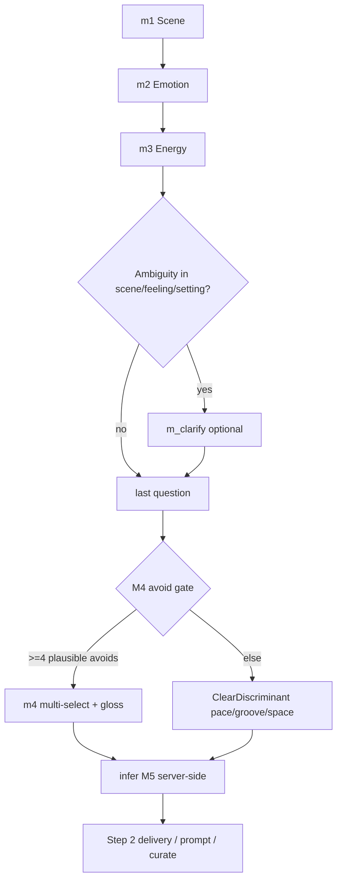

# Interview strategy (target design)

**Status:** Documented — not yet implemented (production still uses fixed `m1 → m2 → m3 → m5 → m4`).

**Canonical product spec:** `~/.cursor/skills/create-playlist/step-1-interview.md`  
**Current implementation:** `apps/api/src/llm/interview/` + `apps/api/src/types/interview-step.ts`

---

## One-sentence goal

Help users who *don't know what they want* by asking **easy feeling questions** (where am I, how do I feel); let the **agent** decide music texture, genre splits, and timbre — never ask the user to solve an ambiguous sonic metaphor quiz.

---

## Product principles

### What we ask the user

| Ask | Don't ask |
|-----|-----------|
| Where am I? What's around me? | What genre? What instrument? |
| How do I feel in this moment? | What should the music texture be? |
| How does my body want to move? | Major or minor? Sparse or dense arrangement? |
| What must we **not** sound like? (plain + gloss) | Cryptic sonic metaphors with no decoder |

### Two question modes only — never hybrid

**1. SceneFeeling** (default)

- Poetic, vivid language is welcome when options are **concrete film-stills** the user can inhabit.
- User test: *"Can I answer by picturing where I am and how I feel — without guessing this is about music production?"*
- Used for: M1 Scene, M2 Emotion, M3 Energy, optional `m_clarify`.

**2. ClearDiscriminant** (last question only, when needed)

- One plain axis; options use the pattern `[plain motion / groove / avoid type], [optional image]`.
- Example: *"Steady pulse, like tidying up"* · *"Slow loose sway, not ready to leave"*.
- **Mandatory parenthetical gloss** on every option (EN/ZH) when the main line is poetic.
- Used for: M4 Avoid (when gate passes) or last-turn pace/groove/space split when avoid gate fails.

### Hard bans (regression anti-patterns)

These patterns must fail verify / never ship:

| Bad example | Why it fails |
|-------------|--------------|
| Stem: *"Late on the platform, the vending hum stains the air — where does it land?"* | Personifies sound; user must guess sonic axis |
| Options: *"Near enough to breathe"* · *"Thin, out past the tiles"* · *"Low and iron-dark"* | Abstract sonic metaphor without scene anchor or gloss |
| Dimension label **质感 / Sound** on a user-facing step | Primes "music texture decision" mental model |
| Stems: *"where does it land?"* · *"声流先落向哪一处？"* | Sound as subject; neither poetic scene nor clear question |
| Options that differ only by production adjectives | Loses both poetry and clarity |

### Good reference (keep doing this)

**Q1 Scene — concrete setting:**

- Stem: *"Blue light on the stair landing — what waits by the door?"*
- Options: keys on the sill · porch boards, rain still cooling · train doors, bodies shifting
- User picks a **place/moment**; agent infers mood, pace, and sonic palette downstream.

---

## Target flow (4–5 questions, dynamic)

```text
m1 Scene (SceneFeeling, required)
  → m2 Emotion (SceneFeeling, required)
  → m3 Energy (SceneFeeling, required)
  → [optional] m_clarify Moment (SceneFeeling — only if planner detects ambiguity)
  → m4 Avoid OR ClearDiscriminant (required last step)
  → [server] infer M5 sonic palette (never shown as interview step)
```



### Step definitions

| ID | Label (EN / ZH) | Mode | Required | Role |
|----|-----------------|------|----------|------|
| `m1` | Scene / 场景 | SceneFeeling | yes | Partition hypothesis space; 6–8 options across six scene regions |
| `m2` | Emotion / 情绪 | SceneFeeling | yes | Emotional color through scene images |
| `m3` | Energy / 能量 | SceneFeeling | yes | Body tempo / groove through motion images |
| `m_clarify` | Moment / 一刻 | SceneFeeling | **optional** | One new scene beat on a flagged axis when M1–M3 leave ambiguity |
| `m4` | Avoid / 避开 | ClearDiscriminant | yes | Multi-select negatives **or** plain last discriminator |

**Remove** user-facing `m5` from the interview sequence. M5 (sonic palette) is **inferred** by the API before prompt/curate.

---

## Planner behavior (full mode)

After each turn — especially after M3 — the private plan phase must answer:

1. **Gap check:** Which scene/feeling/setting dimensions are still ambiguous?
2. **Hypotheses:** List 2–10 genre clusters still plausible (internal only; never shown).
3. **Clarification gate:** Should we insert `m_clarify`?
4. **Inferred M5:** Draft 1–2 concrete timbre cues from answers so far (internal only until prompt).
5. **Last-question routing:** M4 avoid vs ClearDiscriminant?

### Insert `m_clarify` when

- ≥2 genre clusters still plausible **and** the gap is scene / feeling / setting (not sonic gear).
- Prior answers lightly contradict (e.g. kinetic scene + very-slow energy).
- Opening message left a hole M1–M3 did not fill.

### Skip `m_clarify` when

- M1–M3 already partition hypotheses enough for prompt and curate.

### Plan output shape (extend `turnPlanSchema`)

```json
{
  "gaps": ["social distance still ambiguous"],
  "hypotheses": ["indie folk intimate", "cool jazz lounge", "trip-hop dusk"],
  "needsClarification": true,
  "clarificationAxis": "social distance",
  "inferredM5": "whisper-close, worn tape warmth, sparse layers",
  "lastQuestionMode": "avoid | clear_discriminant",
  "axis": "...",
  "sceneBeat": "...",
  "filterDrops": [],
  "stemGuidance": "...",
  "optionGuidance": "..."
}
```

**Fast mode:** Same JSON shape; lighter heuristics embedded in the single-shot prompt self-check.

---

## M4 avoid gate (unchanged from skill)

Do **not** ask a fake avoid question when filtering leaves mostly dead options.

| After filtering… | Last question should be… |
|------------------|--------------------------|
| ≥4 non-obvious M4 avoids | M4 multi-select; poetic chips OK with **required gloss** |
| <4 plausible avoids | ClearDiscriminant on pace, groove, or space (skill Q4 **1a/1c**) |

Implied avoids (gym, club, aggressive) still go into the final prompt prose even when dropped as options.

---

## Genre coverage

Primary mechanism: **Q1 scene partition** across six regions (keep existing `Q1_COVERAGE_REGIONS`):

| Region | Genre families kept reachable |
|--------|-------------------------------|
| intimate-still | ambient, folk, neo-classical, intimate singer-songwriter |
| bittersweet-mid | indie, alt, mellow pop, sad-not-heavy R&B |
| focus-flow | focus electronic, lo-fi, light jazz, instrumental |
| social-mid | indie pop, soul/R&B, mellow hip-hop, lounge |
| kinetic-high | house/techno energy, upbeat pop, gym-pop, rock drive |
| restless-charged | alt-rock, charged R&B, post-punk, restless electronic |

Q2–Q3 narrow; optional `m_clarify` resolves remaining scene/feeling splits; **sonic inference** resolves timbre without a genre menu.

---

## Server-side M5 inference

New module (planned): `apps/api/src/llm/infer-sonic.ts`

**Input:** `m1`, `m2`, `m3`, optional `m_clarify`, `m4`, opening context.  
**Output:** synthetic `m5` `{ id, label, labelEn }` — 1–2 concrete timbre cues for Step 2.

**Call sites:**

- `apps/api/src/llm/spotify-prompt.ts` — paragraph must include sonic cues; expand from scene/feeling picks.
- `apps/api/src/brief.ts` — compact brief `sonic` field; prefer stored labels over static id maps.
- `apps/api/src/routes/curate` path — same brief.

**Backward compat:** If stored session already has `m5` (old interviews), skip inference.

---

## Prompt & verify changes (when implementing)

### Replace `m5FeltAxesBlock()` with

- **`sceneFeelingBlock()`** — M1, M2, M3, `m_clarify` rules and good/bad examples.
- **`clearDiscriminantBlock()`** — last-question plain language + mandatory gloss.

### New verify checks

- **User-decodability:** fail if >50% of options need music knowledge to distinguish.
- **`m_clarify`:** fail if axis is sonic / timbre / instrument.
- **Forbidden stems:** list including vending-hum / where-does-it-land patterns.
- **Gloss:** fail cryptic M3 options without gloss; fail ClearDiscriminant options without gloss.
- Consider **fail closed** on verify parse errors for `m_clarify` and last step (today defaults to pass).

---

## API & web contract (when implementing)

### API `POST /api/interview/next`

- Resolve step via `resolveInterviewStep(stepIndex, priorAnswers)` (dynamic 4 vs 5 steps).
- Response adds: `{ totalSteps, stepIds, optionalClarifyIncluded }`.
- Infer `m5` in `/api/prompt` and `/api/curate` when absent (simpler than new complete endpoint).

### Web

| File | Change |
|------|--------|
| `apps/web/src/lib/interview-meta.ts` | Dynamic step ids; drop hardcoded `m5` |
| `apps/web/src/scripts/interview-wizard.ts` | Use API `totalSteps` |
| `apps/web/src/lib/build-prompt.ts` | Valid if `m1–m3` + `m4`; `m5` optional |
| `apps/web/src/lib/types.ts` | `m_clarify?`, `m5?` optional |

---

## Skill canon sync (when implementing)

Update `~/.cursor/skills/create-playlist/step-1-interview.md`:

- Web mapping: optional `m_clarify`; M5 inferred server-side.
- Add wrong vs right pair for the vending-hum / 质感 failure.
- Gloss rule: cryptic SceneFeeling options may need gloss; ClearDiscriminant always does.

---

## Implementation checklist

Use this order when picking up the work:

1. [ ] Types + `resolveInterviewStep()` dynamic sequence (`interview-step.ts`)
2. [ ] Plan schema + clarification gate after M3 (`plan.ts`, `prompts.ts`)
3. [ ] Prompt rewrite: two modes; remove M5 interview blocks (`prompts.ts`)
4. [ ] Verify tightening (`verify.ts`)
5. [ ] `infer-sonic.ts` + wire prompt/curate/brief
6. [ ] API response `totalSteps` + web wizard dynamic count
7. [ ] Skill doc sync + regression scripts (`test-interview-step.ts`, Q1 batch coverage)

No database migration. Deploy: API + web only.

---

## Testing matrix (acceptance)

1. Fresh interview: Q1 always has six region coverage; ≥1 kinetic/crowd option.
2. No user-facing step labeled 质感 / Sound.
3. Optional `m_clarify` only appears when plan sets `needsClarification: true`.
4. Last question never uses opaque sonic metaphor without gloss.
5. Prompt paragraph includes concrete timbre after interview **without** user answering an M5 chip.
6. Old sessions with `m5` stored still complete prompt/build path.

---

## Current vs target (quick reference)

| | **Today (production)** | **Target (this doc)** |
|--|------------------------|------------------------|
| Steps | 5 fixed | 4–5 dynamic |
| Order | m1, m2, m3, **m5**, m4 | m1, m2, m3, [**m_clarify**], m4 |
| Sonic palette | User answers Q4 质感 | Agent infers M5 |
| Question modes | Mixed (poetic M5 fails) | SceneFeeling **or** ClearDiscriminant only |
| Planner | Per-turn plan | + clarification gate + inferred M5 |
